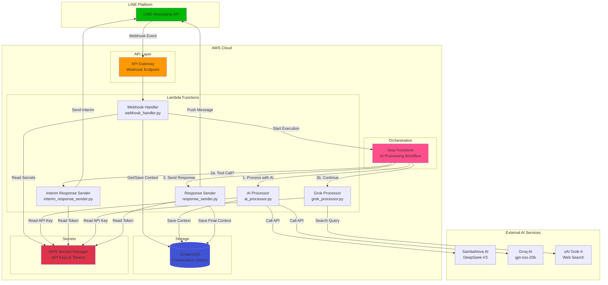
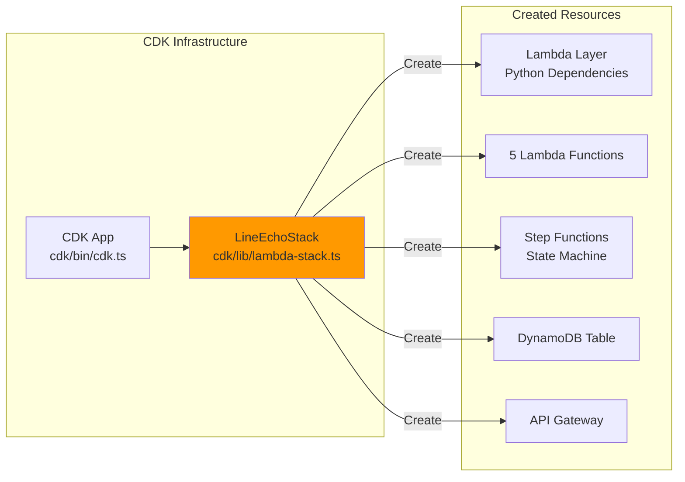
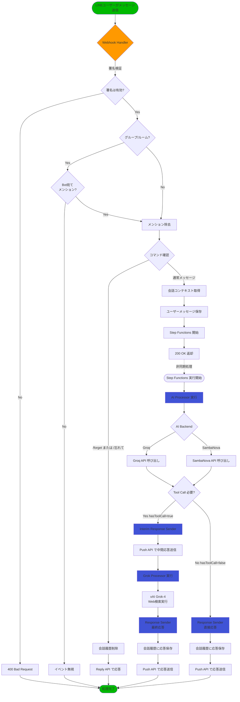
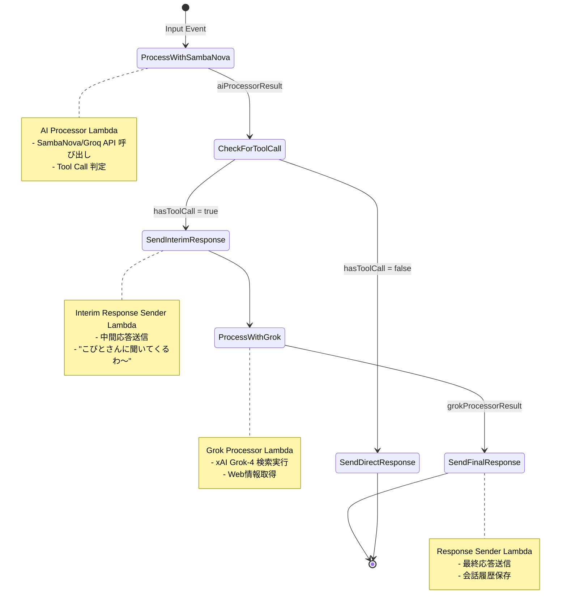
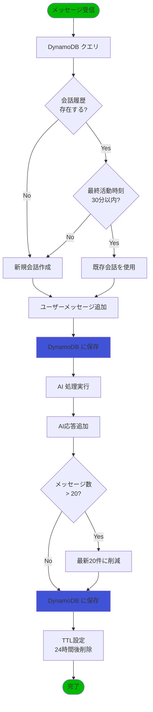

# LINE Bot アーキテクチャ解説

## システム概要

このLINE Botは、AI処理機能を備えた高度な会話型アプリケーションです。関西弁で対話する「あいちゃん」という個性を持ち、必要に応じてWeb検索を行って最新情報を提供します。

### 主な機能

- LINE メッセージの受信と処理
- AI（SambaNova / Groq）による自然言語処理
- Web検索機能（xAI Grok）の統合
- 会話履歴の管理（DynamoDB）
- グループチャット対応（メンション機能）
- 会話履歴削除コマンド（/forget, /忘れて）

---

## システムアーキテクチャ

### 全体構成図



### インフラストラクチャレイヤー



---

## 処理フロー

### メッセージ処理の全体フロー



### Step Functions ワークフロー詳細



### 会話履歴管理フロー



---

## コンポーネント詳細

### 1. Webhook Handler (`webhook_handler.py`)

**役割**: LINEからのWebhookイベントを受信し、初期処理を行う

**主な機能**:
- LINE署名の検証
- グループチャット対応（メンション確認）
- メンション除去処理
- 会話履歴の取得/作成
- Step Functionsワークフローの開始
- `/forget` コマンド処理

**環境変数**:
- `CHANNEL_SECRET_NAME`: LINE Channel Secret（Secrets Manager）
- `CHANNEL_ACCESS_TOKEN_NAME`: LINE Channel Access Token（Secrets Manager）
- `CONVERSATION_TABLE_NAME`: DynamoDB テーブル名
- `STEP_FUNCTION_ARN`: Step Functions ARN

**処理時間**: 通常 < 3秒

---

### 2. AI Processor (`ai_processor.py`)

**役割**: AIバックエンドを使用してメッセージを処理し、Tool Call判定を行う

**主な機能**:
- SambaNova または Groq API 呼び出し
- システムプロンプト構築（関西弁キャラクター設定）
- 時間帯に応じた挨拶生成
- Tool Call 判定（Web検索が必要か）
- 会話履歴保存

**AIバックエンド**:
- **Groq**: `openai/gpt-oss-20b` モデル（推論能力強化）
- **SambaNova**: `DeepSeek-V3-0324` モデル

**Tool定義**:
```json
{
  "name": "search_with_grok",
  "description": "リアルタイムのWeb情報が必要な、専門的または複雑な質問に答えるために使用します。",
  "parameters": {
    "query": "検索クエリ",
    "prompt": "検索結果の使用方法説明"
  }
}
```

**環境変数**:
- `SAMBA_NOVA_API_KEY_NAME`: SambaNova API Key（Secrets Manager）
- `GROQ_API_KEY_NAME`: Groq API Key（Secrets Manager）
- `CONVERSATION_TABLE_NAME`: DynamoDB テーブル名
- `AI_BACKEND`: AIバックエンド選択（`groq` または `sambanova`）

**処理時間**: 5-15秒（API応答時間に依存）

---

### 3. Interim Response Sender (`interim_response_sender.py`)

**役割**: Web検索中であることをユーザーに通知

**主な機能**:
- Push API を使用して中間応答送信
- グループチャットの Quote Token 対応

**送信メッセージ例**:
- "ちょっと待ってな〜 こびとさんに聞いてくるわ！"
- "検索してみるわ〜"

**環境変数**:
- `CHANNEL_ACCESS_TOKEN_NAME`: LINE Channel Access Token（Secrets Manager）

**処理時間**: < 3秒

---

### 4. Grok Processor (`grok_processor.py`)

**役割**: xAI Grok-4を使用してWeb検索を実行

**主な機能**:
- xAI Grok-4 API 呼び出し
- Web検索パラメータ設定
- 検索結果の関西弁変換

**使用モデル**:
- **xAI Grok-4**: リアルタイムWeb検索機能付き

**環境変数**:
- `XAI_API_KEY_SECRET_NAME`: xAI API Key（Secrets Manager）

**処理時間**: 10-30秒（検索複雑度に依存、最大180秒）

---

### 5. Response Sender (`response_sender.py`)

**役割**: 最終応答をLINEに送信し、会話履歴を保存

**主な機能**:
- Push API を使用してメッセージ送信
- グループチャットの Quote Token 対応
- 会話履歴への応答追加
- 会話履歴のクリーンアップ（最新20件保持）

**環境変数**:
- `CHANNEL_ACCESS_TOKEN_NAME`: LINE Channel Access Token（Secrets Manager）
- `CONVERSATION_TABLE_NAME`: DynamoDB テーブル名

**処理時間**: < 5秒

---

### 6. DynamoDB（会話履歴）

**テーブル構造**:

| 属性名 | 型 | 説明 |
|--------|-----|------|
| `userId` | String (PK) | LINEユーザーID |
| `conversationId` | String | 会話セッションID |
| `messages` | List | メッセージ配列 |
| `lastActivity` | String | 最終活動時刻（ISO 8601） |
| `ttl` | Number | TTL（24時間後自動削除） |

**メッセージオブジェクト構造**:
```json
{
  "role": "user|assistant",
  "content": "メッセージ内容",
  "timestamp": "2025-10-23T12:34:56.789Z"
}
```

**会話管理ルール**:
- 30分以内の活動 → 既存会話を継続
- 30分以上経過 → 新規会話を作成
- 最新20件のメッセージを保持
- 24時間後に自動削除（TTL）

---

## データフロー図

### メッセージから応答までのデータ変換

```mermaid
flowchart LR
    subgraph "Input"
        LINE_MSG[LINE Message<br/>webhookイベント]
    end

    subgraph "Webhook Handler"
        EXTRACT[データ抽出<br/>userId, text, replyToken]
        CONTEXT[会話コンテキスト<br/>取得/作成]
    end

    subgraph "Step Functions Input"
        SF_INPUT["{<br/>userId,<br/>conversationContext,<br/>sourceType,<br/>sourceId,<br/>quote_token<br/>}"]
    end

    subgraph "AI Processor"
        AI_INPUT[会話履歴]
        AI_OUTPUT["{<br/>hasToolCall,<br/>aiResponse / toolQuery<br/>}"]
    end

    subgraph "Grok Processor"
        GROK_INPUT[toolQuery]
        GROK_OUTPUT["{<br/>grokResponse<br/>}"]
    end

    subgraph "Response Sender"
        RESP_INPUT[aiResponse or<br/>grokResponse]
        RESP_OUTPUT[LINE Push Message]
    end

    subgraph "Output"
        LINE_RESP[LINE応答]
    end

    LINE_MSG --> EXTRACT
    EXTRACT --> CONTEXT
    CONTEXT --> SF_INPUT
    SF_INPUT --> AI_INPUT
    AI_INPUT --> AI_OUTPUT

    AI_OUTPUT -->|hasToolCall=true| GROK_INPUT
    AI_OUTPUT -->|hasToolCall=false| RESP_INPUT

    GROK_INPUT --> GROK_OUTPUT
    GROK_OUTPUT --> RESP_INPUT
    RESP_INPUT --> RESP_OUTPUT
    RESP_OUTPUT --> LINE_RESP

    style LINE_MSG fill:#00B900
    style LINE_RESP fill:#00B900
    style SF_INPUT fill:#FF9900
    style AI_OUTPUT fill:#4053D6
    style GROK_OUTPUT fill:#4053D6
```



---

## 使用技術スタック

### インフラストラクチャ

| 技術 | 用途 |
|------|------|
| AWS CDK (TypeScript) | インフラストラクチャ as Code |
| AWS Lambda | サーバーレス実行環境 |
| AWS API Gateway | Webhookエンドポイント |
| AWS Step Functions | ワークフローオーケストレーション |
| AWS DynamoDB | 会話履歴ストレージ |
| AWS Secrets Manager | 認証情報管理 |

### アプリケーション

| 技術 | 用途 |
|------|------|
| Python 3.12 | Lambda 関数実装 |
| LINE Bot SDK v3 | LINE Messaging API 連携 |
| OpenAI SDK | AI API 呼び出し |
| xAI SDK | Grok API 呼び出し |
| boto3 | AWS サービス連携 |

### 外部サービス

| サービス | 用途 | モデル |
|----------|------|--------|
| SambaNova | AI 処理 | DeepSeek-V3-0324 |
| Groq | AI 処理（高速推論） | openai/gpt-oss-20b |
| xAI Grok | Web 検索 | Grok-4 |
| LINE Messaging API | メッセージング | - |

---

## セキュリティ

### 認証情報管理

- すべてのAPIキーとトークンは **AWS Secrets Manager** で管理
- Lambda関数は実行時に動的に取得
- GitHub Actionsがデプロイ時に自動作成

### アクセス制御

- Lambda関数に最小権限の IAM Role を付与
- Secrets Manager への読み取り専用アクセス
- DynamoDB への読み書きアクセス（必要な関数のみ）
- Step Functions への実行権限（Webhook Handler のみ）

### データ保護

- DynamoDB の暗号化（デフォルト）
- 24時間後の自動削除（TTL）
- 会話履歴は20件に制限

---

## デプロイメント

### GitHub Actions CI/CD

```mermaid
flowchart TD
    PUSH[Git Push to main] --> ACTIONS[GitHub Actions 起動]

    ACTIONS --> BUILD_LAYER[Lambda Layer ビルド]
    BUILD_LAYER --> SYNC_SECRETS[Secrets Manager 同期]
    SYNC_SECRETS --> CDK_DEPLOY[CDK Deploy]

    CDK_DEPLOY --> CREATE_STACK[CloudFormation Stack 作成/更新]
    CREATE_STACK --> DEPLOY_LAMBDA[Lambda Functions デプロイ]
    DEPLOY_LAMBDA --> CREATE_SF[Step Functions 作成]
    CREATE_SF --> CREATE_API[API Gateway 作成]

    CREATE_API --> OUTPUT[デプロイ完了<br/>API URL 出力]

    style PUSH fill:#333
    style OUTPUT fill:#00B900
```



### デプロイコマンド

```bash
# ローカルからのデプロイ
cd cdk
npm install
npm run build
npx cdk deploy

# GitHub Actionsによる自動デプロイ
# main ブランチへの push で自動実行
```

---

## トラブルシューティング

### よくある問題と解決方法

#### 1. Lambda関数がタイムアウトする

**原因**: AI API の応答が遅い、または Grok 検索が複雑

**解決策**:
- Lambda のタイムアウト設定を確認（Grok Processor は180秒）
- CloudWatch Logs でエラーログを確認
- AI_BACKEND 環境変数を `groq` に変更（高速）

#### 2. 会話履歴が保存されない

**原因**: DynamoDB の権限不足、またはテーブル名の不一致

**解決策**:
- Lambda の IAM Role を確認
- 環境変数 `CONVERSATION_TABLE_NAME` を確認
- DynamoDB テーブルの存在を確認

#### 3. グループチャットでBotが反応しない

**原因**: メンション機能の問題

**解決策**:
- Bot をグループに追加しているか確認
- @メンションで Bot を指定しているか確認
- CloudWatch Logs で "No mention found" ログを確認

---

## パフォーマンス指標

### 処理時間の目安

| シナリオ | 処理時間 |
|----------|----------|
| 通常の会話（Tool Call なし） | 5-10秒 |
| Web検索あり（Tool Call あり） | 15-40秒 |
| 会話履歴削除コマンド | 2-3秒 |

### コスト試算（月間1000メッセージ）

- Lambda 実行時間: $0.50
- DynamoDB: $0.25
- API Gateway: $0.10
- Step Functions: $0.15
- 外部API（SambaNova/Groq/xAI）: 従量課金

**合計**: 約 $1-2/月（外部API除く）

---

## 今後の拡張案

### 機能拡張

- 画像メッセージ対応
- スタンプメッセージ対応
- リッチメニュー実装
- マルチモーダル AI 対応

### パフォーマンス改善

- Lambda のウォームアップ
- DynamoDB の DAX キャッシュ
- AI レスポンスのストリーミング対応

### 監視・運用

- CloudWatch アラーム設定
- X-Ray トレーシング有効化
- コスト監視ダッシュボード

---

## まとめ

このLINE Botは、以下の特徴を持つ高度なサーバーレスアーキテクチャです：

1. **スケーラブル**: サーバーレス構成により自動スケーリング
2. **高可用性**: AWS マネージドサービスの活用
3. **コスト効率**: 従量課金による低コスト運用
4. **保守性**: CDK によるインフラ管理、明確なコンポーネント分離
5. **拡張性**: Step Functions による柔軟なワークフロー

関西弁キャラクター「あいちゃん」として、ユーザーとの自然な会話を実現しながら、必要に応じてWeb検索で最新情報を提供する、実用的なLINE Botです。
