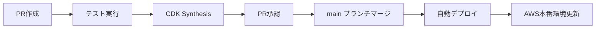

# CI/CD セットアップガイド

## GitHub Secretsの設定

以下のシークレットをGitHubリポジトリの Settings > Secrets and variables > Actions で設定してください：

### AWS認証情報
- `AWS_ACCESS_KEY_ID`: AWS アクセスキーID
- `AWS_SECRET_ACCESS_KEY`: AWS シークレットアクセスキー

### LINE Bot認証情報
- `CHANNEL_ACCESS_TOKEN`: LINE Bot チャンネルアクセストークン
- `CHANNEL_SECRET`: LINE Bot チャンネルシークレット

### SambaNova API認証情報
- `SAMBA_NOVA_API_KEY`: SambaNova Cloud APIキー

## ワークフローの動作

### Pull Request時
1. **テスト実行**: CDKコードのビルドとテストを実行
2. **CDK Synthesis**: CloudFormationテンプレートの生成を確認

### Main ブランチへのマージ時
1. **テスト実行**: 全てのテストを実行
2. **AWS認証**: GitHub Secretsを使用してAWSに認証
3. **デプロイ**: CDKを使用してAWSにデプロイ
4. **結果通知**: デプロイ成功/失敗の結果を表示

## デプロイプロセス

## 失敗時のトラブルシューティング

### 1. AWS認証エラー
- GitHub Secretsの`AWS_ACCESS_KEY_ID`と`AWS_SECRET_ACCESS_KEY`が正しく設定されているか確認
- IAMユーザーに必要な権限があるか確認

### 2. CDKデプロイエラー
- `.env.local`の環境変数とGitHub Secretsの値が一致しているか確認
- AWSリソースの制限に達していないか確認

### 3. テストエラー
- ローカルでテストを実行して問題を特定
- `npm test`でテストを実行

## 必要なAWS権限

デプロイ用のIAMユーザーには以下のサービスへの権限が必要です：
- CloudFormation
- Lambda
- DynamoDB
- Step Functions
- API Gateway
- IAM
- S3 (CDK assets用)

## セキュリティ考慮事項

- GitHub Secretsは暗号化されて保存されます
- secretsの値はワークフローログに出力されません
- 本番環境の認証情報は適切に管理してください